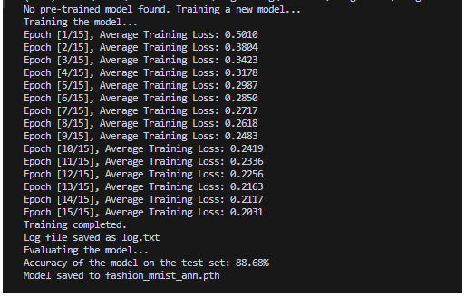
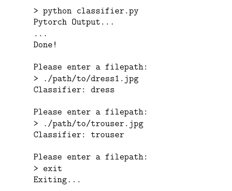
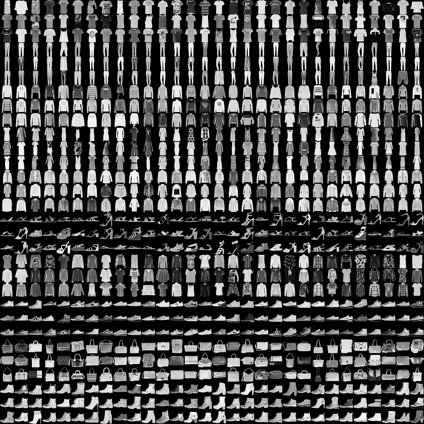

# PyTorch Fashion MNIST Classifier

A feedforward Artificial Neural Network (ANN) built in Python using PyTorch to classify clothing items from the FashionMNIST dataset. The project covers the end-to-end machine learning workflow, including data preprocessing, hyperparameter tuning, model training, and a final script for interactive classification of new images.

The final optimized model achieved **88.75% accuracy** on the 10,000-image test set.




---

### Key Concepts & Technologies:
*   **Core Libraries:** **Python, PyTorch, Torchvision, NumPy**
*   **ML Workflow:**
    *   **Data Preprocessing:** Used `torchvision.transforms` for data normalization and conversion to tensors.
    *   **DataLoader:** Implemented batched and shuffled data loading for efficient GPU training.
*   **Neural Network Design:**
    *   Built a custom `nn.Module` with two hidden layers and ReLU activation functions.
    *   Systematically experimented with network architecture (layer depth, neuron count) to improve performance.
*   **Hyperparameter Tuning:** Methodically tested and selected optimal values for learning rate, batch size, and number of epochs to maximize model accuracy and prevent overfitting.
*   **Model Training & Evaluation:**
    *   Utilized Adam optimizer and Cross-Entropy Loss for effective training.
    *   Tracked loss and accuracy per epoch to gauge convergence.
    *   Wrote the code to leverage a CUDA-enabled GPU for accelerated training when available.

---

### How to Use:

1.  **Setup Environment:**
    ```bash
    pip install -r requirements.txt
    ```
    *(Your task: Create a `requirements.txt` file by running `pip freeze > requirements.txt` in your project's virtual environment)*

2.  **Train the Model:**
    ```bash
    python classifier.py
    ```
    *This will train the network and save the final model as `fashion_mnist_model.pth`.*

3.  **Classify a New Image:**
    *   After training, the script will prompt for a file path.
    ```
    Please enter a filepath:
    > ./path/to/your/sneaker_image.jpg
    Classifier: Sneaker
    ```